# Sora技术原理

## Sora是什么

简单理解Sora就是一个能够生成图像和视频的模型。那为什么会这么炸裂，这是因为以前的研究，图像和视频生成是对应不一样的模型，而OpenAI训练的Sora建立的是一种通用的视觉模型方法。

> Sora is a generalist model of visual data——it can generate videos and images spanning diverse durations, aspect ratios and resolutions, up to a full minute of high definition video.

OpenAI做Sora的目标

> 

## Sora能力边界

* 最大支持60秒高清视频生成，以及基于已有短视频的前后扩展，同时保持人物/场景的高度一致性。
* 改变源视频风格or场景，丝滑过渡的视频融合能力
* 同一场景的多角度/镜头的生成能力
* 具有动态摄像机运动的视频。随着摄像机的移动和旋转，人和其他场景元素在三维空间中一致地移动。
* 支持任意分辨率，宽高比的视频输出
* 链接虚拟世界，游戏视频场景生成
* Sora对物理规律的理解仍然十分有限

## Sora模型训练流程

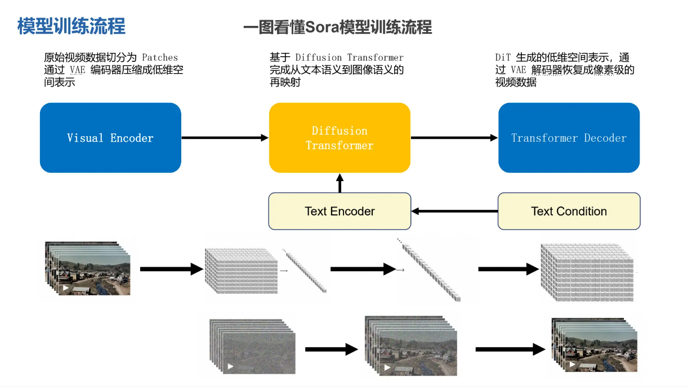

* 原始视频数据切分为Patches通过VAE编码器压缩成低维空间表示
* 基于Diffusion Transformer完成从文本语义到图像语义的再映射
* DiT生成的低维空间表示，通过VAE解码器恢复成像素级的视频数据

### 数据统一

Transforming Visual Data into Patches

> Sora的设计思路与LLM一致，都是将所有输入数据统一化，然后训练模型预测下一个词（LLM是tokens，而Sora是patches，即Sora里的patch是对标LLM里的token）Sora的视频训练和推理的最小单元就是Patch，这个概念是在ViT（Vision Transformer）这篇论文被首次提出的。因为视频其实就是由一系列的图片，按照时间进行排列组成的。

首先将视频压缩到一个低维度的潜在空间（视频数据切成方块，再展开成一维数据）：这是通过对视频进行时间和空间上的压缩实现的。这个潜在空间可以看作是一个“时空包”（Spacetime Latent Patches）的集合，从而将原始视频转化为这些包。

## Sora技术路径

### 扩散模型DDPM

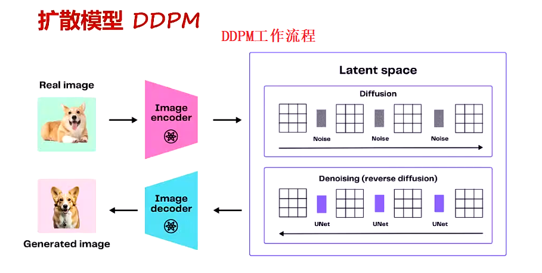

### 扩散模型DDPM的backbone——U-Net

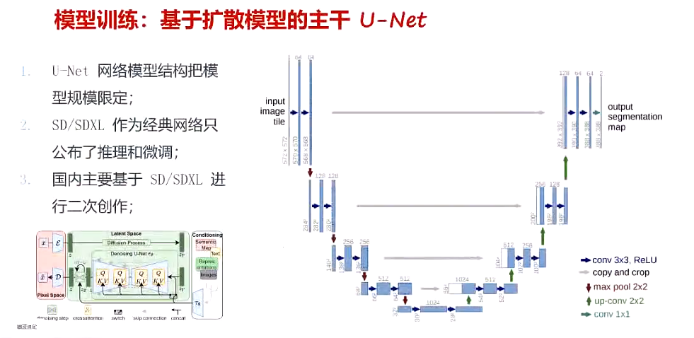

* Stable Diffusion的架构

Sora的骨架是把主干U-Net换成DiT

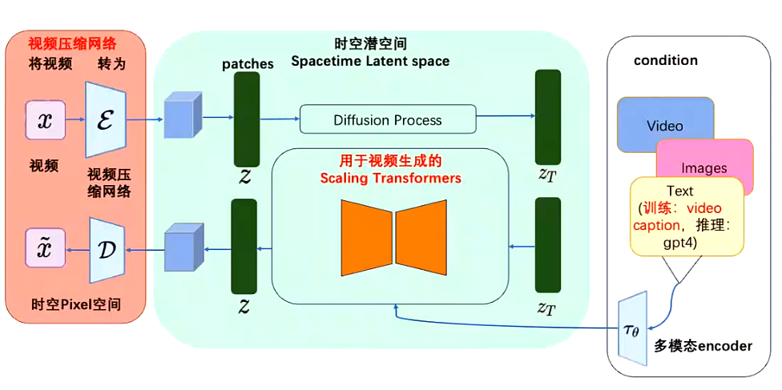

## Sora关键技术拆解

### ViT

Sora里的patch的概念来源于ViT的论文（ViT用于处理图片）。ViT是基于图片做分类

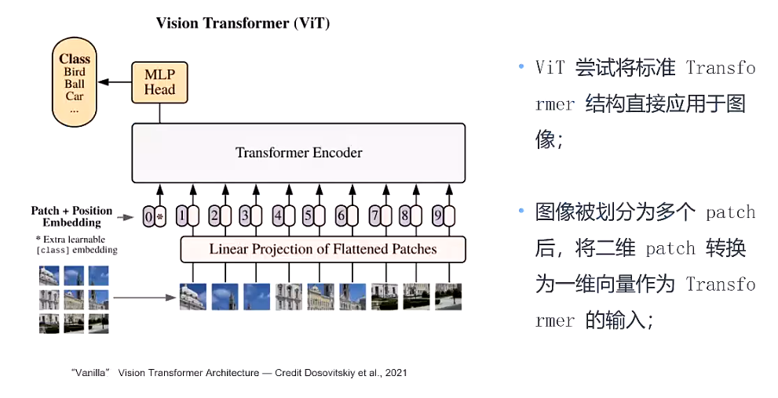

* python的`einops`库可以把图片分割

通过把图片的patch化，就不用关心原来图片的大小是多少，把视频or图像进行原子化

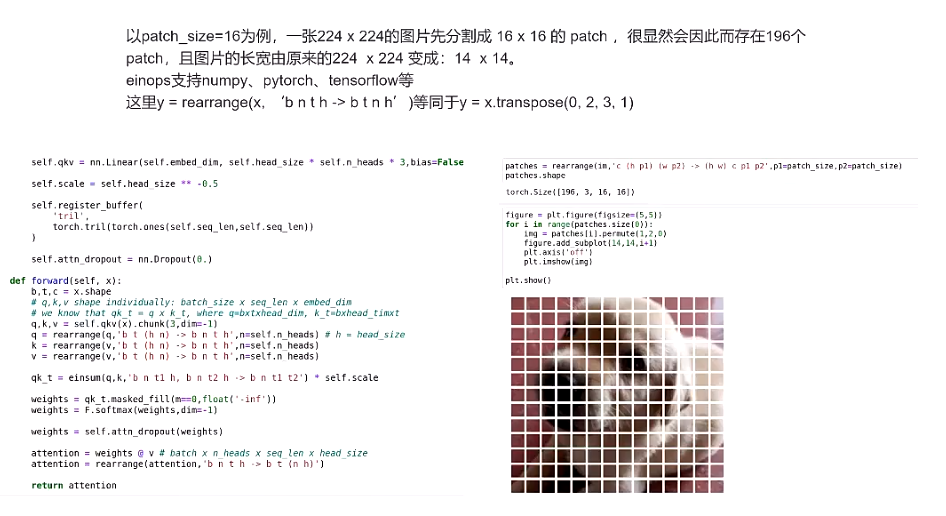

### ViViT

在ViT的基础之上处理视频，增加了时空数据。将时空数据存储之后做索引

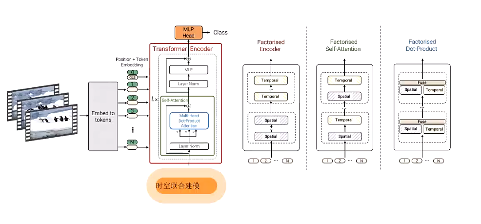

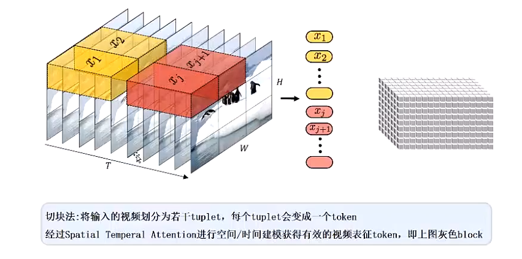

### NaViT

NaViT将多个patches打包成一个单一序列实现可变分辨率

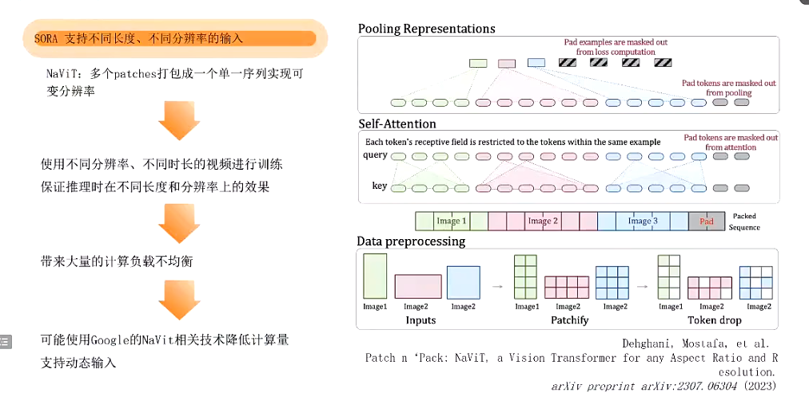

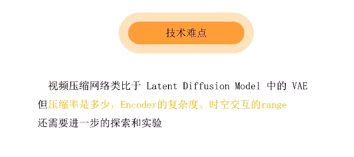

## Diffusion Transformer

Sora的主要作者是Peebles william，他在ICCV上发表了一篇DiT的文章，这篇文章是通过结合diffusion model和transformer，从而达到可以scale up model来提升图像生成质量的效果，这篇文章是在technical report的reference中给出，直观来讲把图像的scaling技术运用到视频场景也非常直观，可以确定是Sora的技术之一。

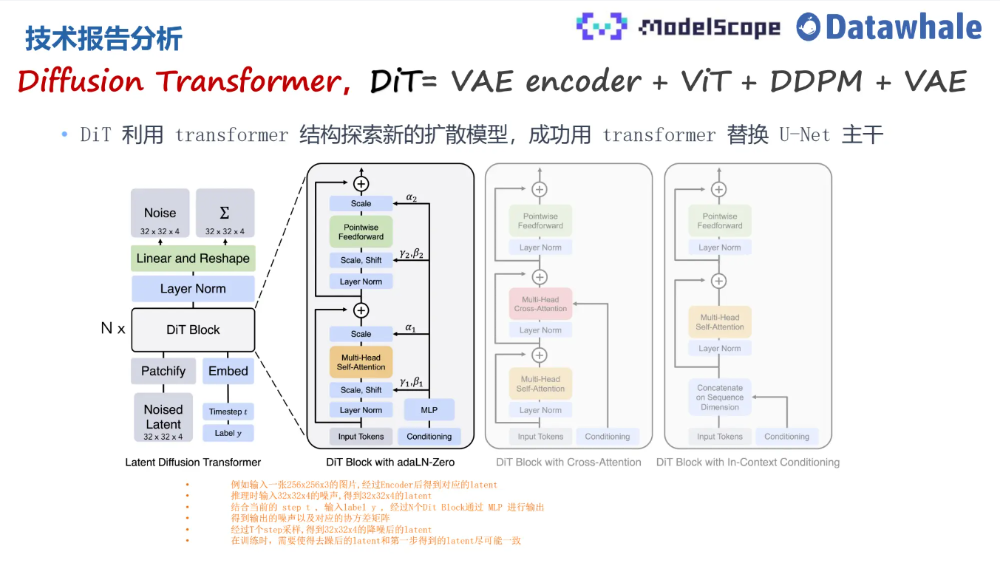

上图展示了DiT的主要原理

* 输入是一张256x256x3的图片，对图片做切patch后经过投影得到每个patch的token，得到32x32x4的latent(在推理时输入直接是32x32x4的噪声)
* 结合当前的step t，输入label y作为输入经过N个DiT Block通过MLP进行输出
* 得到输出的声以及对应的协方差矩阵，经过T个step采样，得到32x32x4的降后的latent。

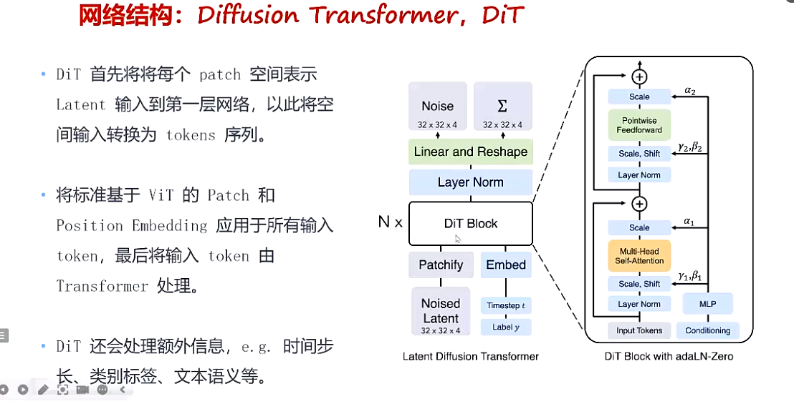

## Sora架构

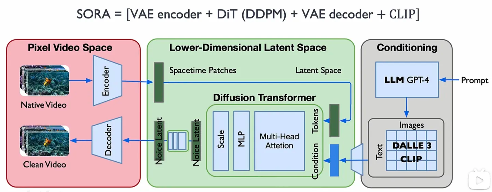

### Sora技术难点

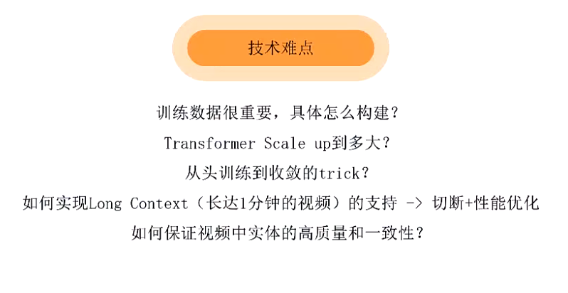

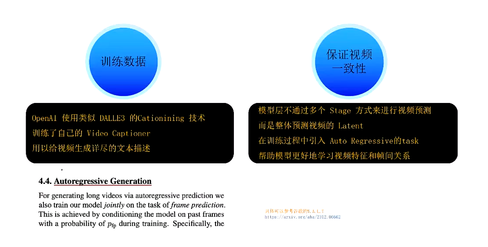

Sora对于图片进行打标签就是通过

CLIP模型可以训练成一个图片自动打标签工具

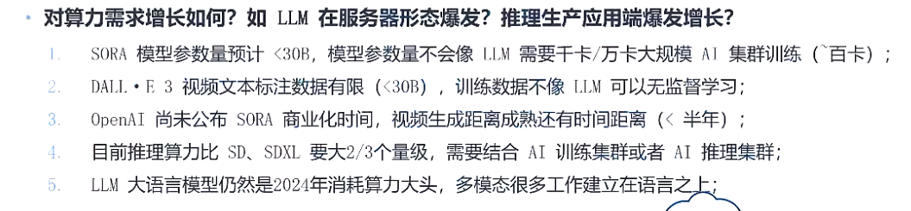

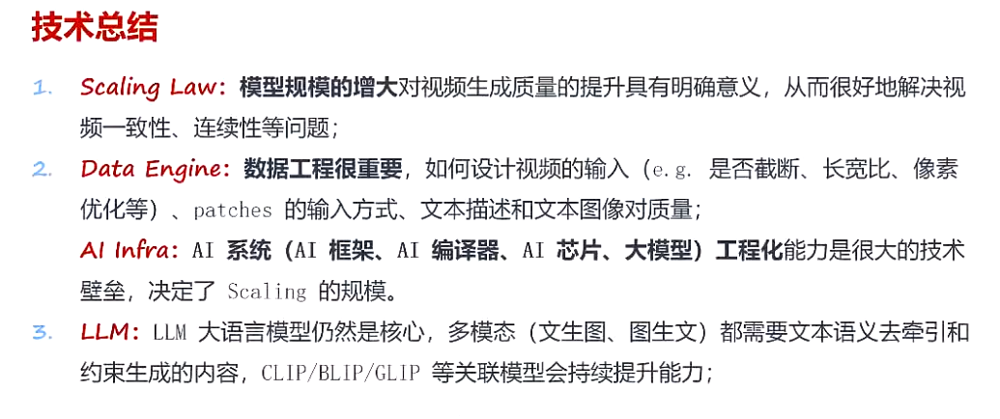

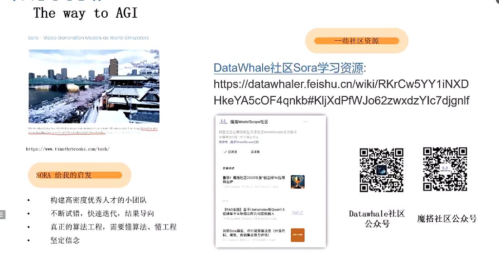

### 名词解释

* DiT（Diffusion Transformer）
* DDPM
* CLIP（**Contrastive Language-Image Pre-training**，即**一种基于对比文本-图像对的预训练方法或者模型**）
* Self-Attention 自注意力
* adaLN-Zero
* W.A.L.T

## 参考

* [Sora技术原理详解](https://www.bilibili.com/video/BV1wm411f7gf)
* [Sora视频生成大模型原理剖析](https://www.bilibili.com/video/BV1Bx4y1k7BQ)

