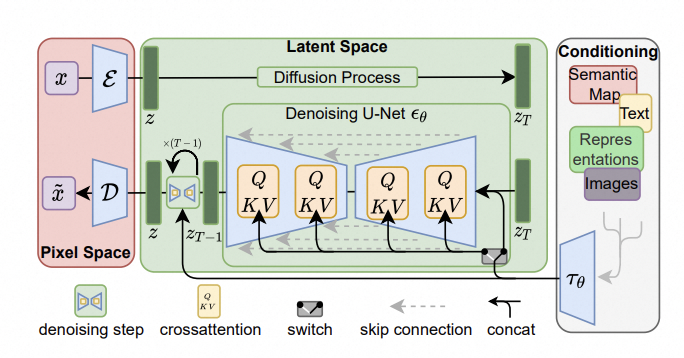
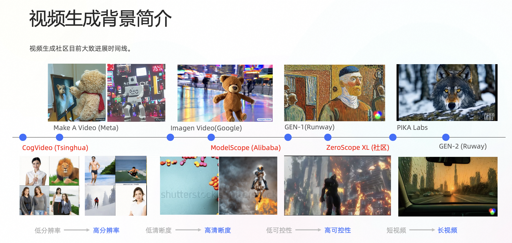
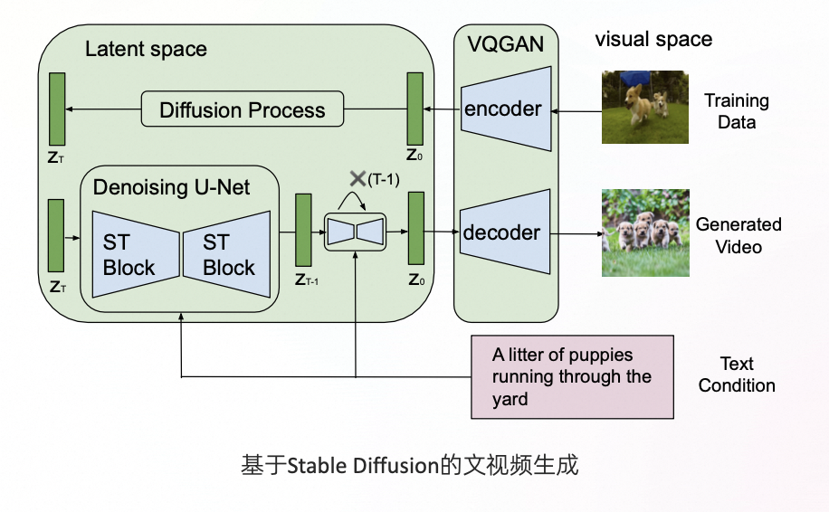
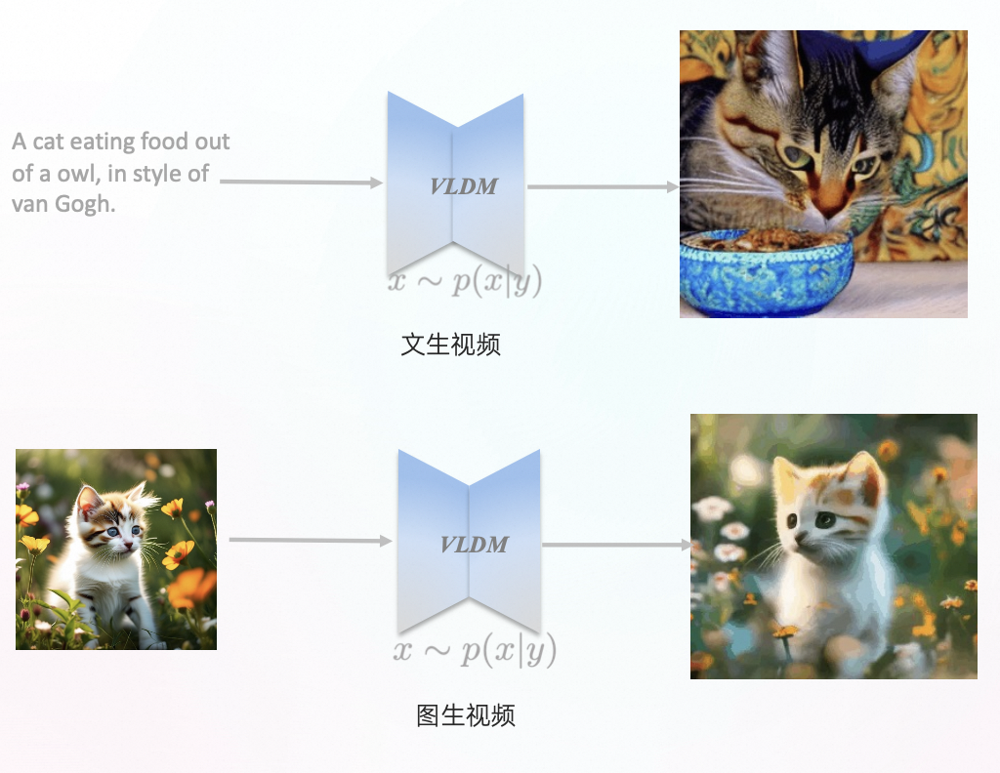

# 文生图片路径技术路径、原理、实战

## AIGC的发展

AIGC在过去的一年很火，全称叫做AI generated content，AlGC (Al-Generated Content，人工智能生产内容)，是利用Al自动生产内容的生产方式。

## 文生图介绍

根据文生图的发展路线，我们把文生图的发展历程发展成如下4个阶段：

- 基于生成对抗网络的（GAN）模型
- 基于自回归(Autoregressive)模型
- 基于扩散(diffusion)模型
- 基于Transformers的扩散（diffusion）模型

### GAN 对抗神经网络

* 优点：
  * 窄分布上生成质量很高
  * 采样速度接近实时
  * 具有语义解耦的可编辑隐空间（Style GANs）
* 缺点：
  * 训练稳定性差
  * 对于复杂数据你和能力有限
  * 会出现Mode Collapse（模式崩塌）

### 基于自回归

基于自回归方式的模型有VQGAN和DALLE1

* 优点：
  * 具有良好的 scaling up 性质
  * 训练稳定
  * 大数据拟合能力强
* 不足：
  * 推理速度慢
  * 框架灵活度不高、可编辑能力弱

### 基于扩散方式的模型

目前大多数文生图模型所采用的技术

* DALLE2

LDM（Latent Diffusion Models）原理图

### 基于Transformers架构的Diffusion模型

基于transformers架构的Diffusion模型的有DiT、PixArt、HDiT

## 文生图最重要的三个的功能

* 提示词（prompt)
* 参考图控制（controlnet）
* 微调训练（Lora）Low-Rank Adaptation

### 提示词（prompt)

正向prompt一般写法：主体描述，细节描述，动作描述，背景描述，色彩描述，修饰词，艺术风格，艺术家

| 负向prompt要素 | 内容示例                     |
| -------------- | ---------------------------- |
| 低质量         | *low quality, worst quality* |
| 色彩单一       | *black and white*            |
| 手部问题       | *missing fingers*            |
| 变形           | deformed                     |
| 裁剪           | *cropped*                    |
| 毁容           | *disfigured*                 |

### 参考图控制（controlnet）

ControlNet是一种用于精确控制图像生成过程的技术组件。它是一个附加到预训练的扩散模型（如Stable Diffusion模型）上的可训练神经网络模块。扩散模型通常用于从随机噪声逐渐生成图像的过程，而ControlNet的作用在于引入额外的控制信号，使得用户能够更具体地指导图像生成的各个方面（如姿势关键点、分割图、深度图、颜色等）。

### Lora

Stable Diffusion中的Lora（LoRA）模型是一种轻量级的微调方法，它代表了“Low-Rank Adaptation”，即低秩适应。Lora不是指单一的具体模型，而是指一类通过特定微调技术应用于基础模型的扩展应用。在Stable Diffusion这一文本到图像合成模型的框架下，Lora被用来对预训练好的大模型进行针对性优化，以实现对特定主题、风格或任务的精细化控制。

## 视频生成技术发展

过去这一年视频生成的发展路径：

基于Stable Diffusion视频生成:将视觉空间的数据映射到隐空间中，通过输入文本(或其他条件)在隐空间训练扩散模型，与图像不同的是地方在于U-Net需具备时序编码的能力。

通常的视频生成的任务有两种：文生视频和图生视频

