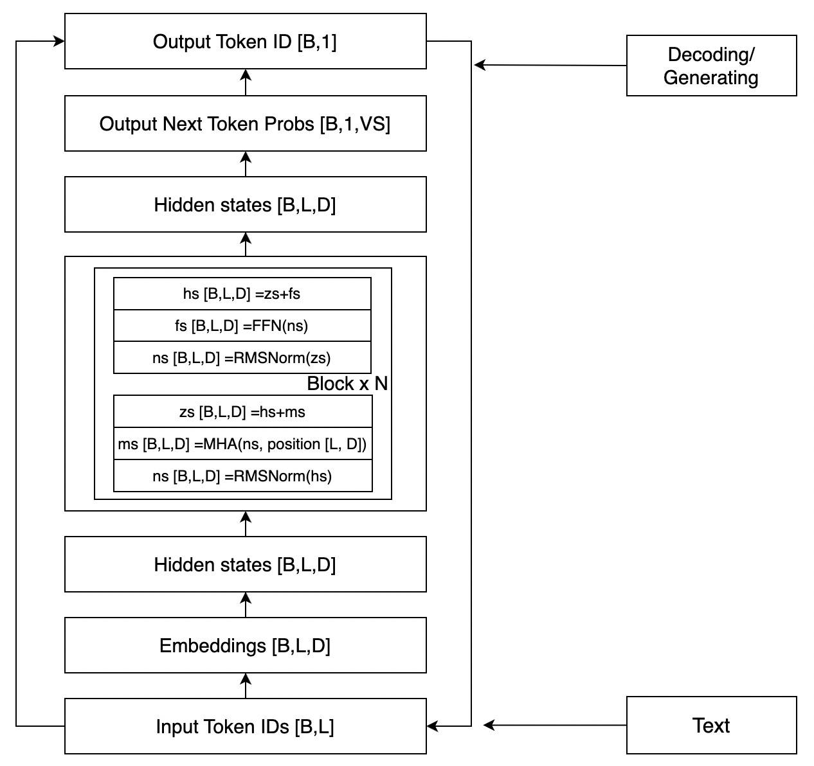

# Attention

从Attention到Self Attention

### Self Attention

"Attention is All You Need" 这篇论文提出了Multi-Head Self-Attention，是一种：Scaled Dot-Product Attention。

$$
\operatorname{Attention}(Q, K, V)=\operatorname{softmax}\left(\frac{Q K^T}{\sqrt{d_k}}\right) V
$$
From：https://arxiv.org/pdf/1706.03762.pdf

Encoder+Decoder

Encoder->self attention

Decoder->self attention


### Multi-Head

Multi-Head可以理解为**多个注意力模块**，期望不同注意力模块**“注意”**到不一样的地方，类似于CNN的Kernel。

> 论文原文：Multi-head attention allows the model to jointly attend to information from different representation subspaces at different positions.

$$
\begin{aligned}
\operatorname{MultiHead}(Q, K, V) & =\operatorname{Concat}\left(\operatorname{head}_1, \ldots, \text { head }_{\mathrm{h}}\right) W^O \\
\text { where head }_{\mathrm{i}} & =\operatorname{Attention}\left(Q W_i^Q, K W_i^K, V W_i^V\right)
\end{aligned}
$$

From: https://arxiv.org/pdf/1706.03762.pdf


self attention的结构是qkv

LLM的结构是qkvo

学习LLM就关注三个内容

* Tokenizer
* Embeddings



* Input Tonke IDs [B,L] -> Embeddings[B,L,D]
  * 查表，多了一个维度D

token的目的是把文本转成数字，token是一个个离散的整数。中文的词表跟因为的词表不一样

## 实战操作

```
# 依赖安装
!pip install torch torchvision torchaudio pandas scikit-learn jieba matplotlib
```


## 额外补充

Pooling 池化/采样层

* max pooling
* average pooling

## 参考链接

- [1] [Attention Is All You Need](https://arxiv.org/pdf/1706.03762.pdf)
- [2] [拆 Transformer 系列一：Encoder-Decoder 模型架构详解](https://zhuanlan.zhihu.com/p/109585084)
- [3] [拆 Transformer 系列二：Multi- Head Attention 机制详解](https://zhuanlan.zhihu.com/p/109983672)
- [4] [LLM都是Decoder only的架构原因解读](https://zhuanlan.zhihu.com/p/620227731)


