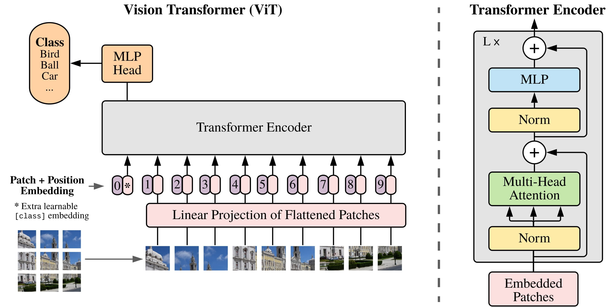

# 基于Transformers Diffusion模型原理解析与实战
## 什么是ViT

Vision Transformer (ViT) 模型由 Alexey Dosovitskiy等人在 An Image is Worth 16x16 Words: Transformers for Image Recognition at Scale 中提出。这是第一篇在 ImageNet 上成功训练 Transformer 编码器的论文，与熟悉的卷积架构相比，取得了非常好的结果。论文提出，虽然 Transformer 架构已成为自然语言处理任务事实上的标准，但其在计算机视觉中的应用仍然有限。 在视觉中，attention要么与卷积网络结合应用，要么用于替换卷积网络的某些组件，同时保持其整体结构不变。 ViT证明这种对 CNN 的依赖是不必要的，直接应用于图像块序列（patches）的纯 Transformer 可以在图像分类任务上表现良好。 当对大量数据进行预训练并转移到多个中型或小型图像识别基准（ImageNet、CIFAR-100、VTAB 等）时，Vision Transformer (ViT) 与SOTA的CNN相比取得了优异的结果，同时需要更少的计算资源来训练，Vision Transformer (ViT) 基本上是 Transformers，但应用于图像。

每个图像被分割成一系列不重叠的块（分辨率如 16x16 或 32x32），并线性embedding，接下来，添加position embedding，并通过编码器层发送。 在开头添加 [CLS] 标记以获得整个图像的表示。 可以在hidden states之上添加MLP head以对图像进行分类。

### ViT架构：

-来自原论文：An Image is Worth 16x16 Words: Transformers for Image Recognition at Scale 

Paper: https://arxiv.org/abs/2010.11929

Official repo (in JAX): https://github.com/google-research/vision_transformer

## ViViT：视频ViT

ViViT基于纯变压器的视频模型分类，借鉴了ViT图像分类中取得的成功。 ViViT从输入视频中提取时空标记，然后由一系列转换器层进行编码。 

源自：Arnab, Anurag, et al. "Vivit: A video vision transformer." ICCV2021

paper：[https://arxiv.org/abs/2103.15691](https://arxiv.org/abs/2103.15691)

### Latte:用于视频生成的潜在扩散变压器

Latte提出了一种新颖的潜在扩散变压器，用于视频生成。Latte 首先从输入视频中提取时空标记，然后采用一系列 Transformer 块对潜在空间中的视频分布进行建模。为了对从视频中提取的大量标记进行建模，从分解输入视频的空间和时间维度的角度引入了四种有效的变体。为了提高生成视频的质量，我们通过严格的实验分析确定了 Latte 的最佳实践，包括视频剪辑补丁嵌入、模型变体、时间步级信息注入、时间位置嵌入和学习策略。我们的综合评估表明，Latte 在四个标准视频生成数据集（即 FaceForensics、SkyTimelapse、UCF101 和 Taichi-HD）上实现了最先进的性能。此外， Latte也 扩展到文本到视频生成 (T2V) 任务，其中 Latte 取得了与最新 T2V 模型相当的结果。我们坚信，Latte 为未来将 Transformer 纳入视频生成扩散模型的研究提供了宝贵的见解。

## TODO

* 代码实践笔记