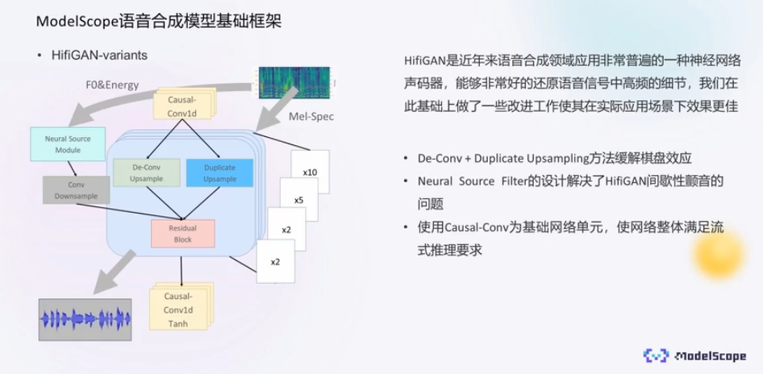
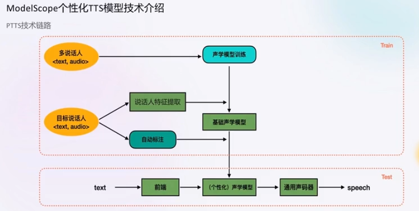
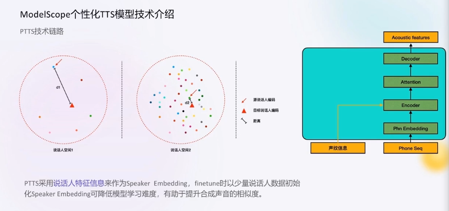
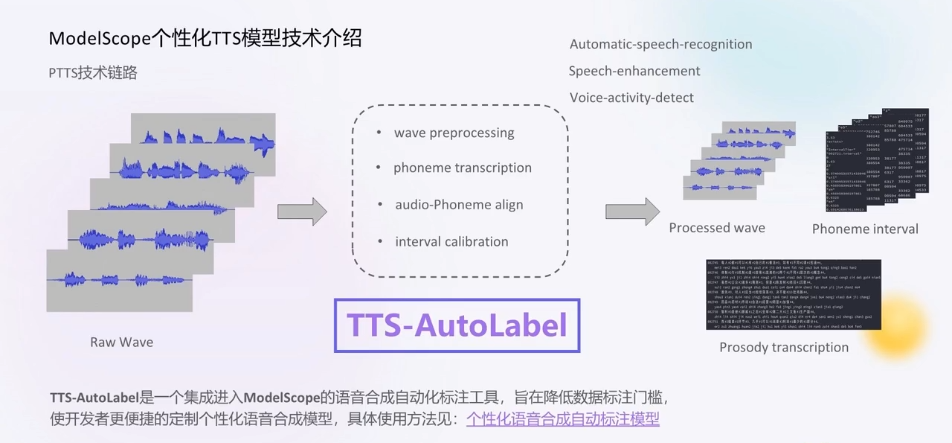

# 声音生成TTS技术解析与实战

## TTS 与 PTTS

语音合成(Text-to-Speech, TTS) 是指将输入文字合成为对应语音信号的功能

Personal TTS，即个性化语音合成，是通过身边的一些常见录音设备（手机、电脑、录音笔等），录取目标说话人的少量语音片段后，构建出这个人的语音合成系统。

## HiFi-GAN

Paper：https://arxiv.org/abs/2010.05646

### HiFi-GAN介绍

HiFi-GAN 能够将声学模型产生的频谱转换为高质量的音频，这种声码器采用生成对抗网络（Generative Adversial Networks，GAN）作为基础生成模型，相比于之前相近的MelGAN，贡献点主要在：

1. 引入了多周期判别器（Multi-Period Discriminator，MPD）。HiFi-GAN同时拥有多尺度判别器（Multi-Scale Discriminator，MSD）和多周期判别器，目标就是尽可能增强GAN判别器甄别合成或真实音频的能力。
2. 生成器中提出了多感受野融合模块。WaveNet为了增大感受野，叠加带洞卷积，逐样本点生成，音质确实很好，但是也使得模型较大，推理速度较慢。HiFi-GAN则提出了一种残差结构，交替使用带洞卷积和普通卷积增大感受野，保证合成音质的同时，提高推理速度。

## ModelSccope个性化TTS模型技术介绍

### Sambert-HiFiGAN 

魔搭的 Sambert-HiFiGAN 也是用的 HiFi-GAN 作为技术底座，并从中进行了技术改进

* De-Conv + Duplicate Upsampling 方法缓解棋盘效应
* Neural Source Filter 的设计解决了HifGAN 间歇性颤音的问题
* 使用 Causal-Conv 为基础网络单元，使网络整体满足流式推理要求

### 说话人特征建模

### TTS-AutoLabel

语音合成训练数据组成包含三部分

* 音频文件
* 音频文件转写（韵律标签）
* 音速时间戳标注

* ASR（Automatic Speech Recognition）语音转文字，再把文字
* speech enhancement 语音增强
* VAD（Voice Activity Detection）语音活动检测

## 个性化语音合成应用场景

* 辅助说话工具
* 助理个性化内容生产
* 个人语音助理

## 参考链接

[语音自动化标注工具](https://modelscope.cn/models/iic/speech_ptts_autolabel_16k/summary)

[魔搭个性声音定制在线体验](https://modelscope.cn/studios/iic/personal_tts/summary)

[SambertHifigan个性化语音合成-中文-预训练-16k](https://modelscope.cn/models/iic/speech_personal_sambert-hifigan_nsf_tts_zh-cn_pretrain_16k/summary)