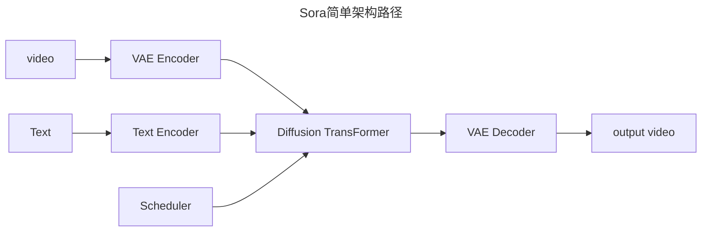
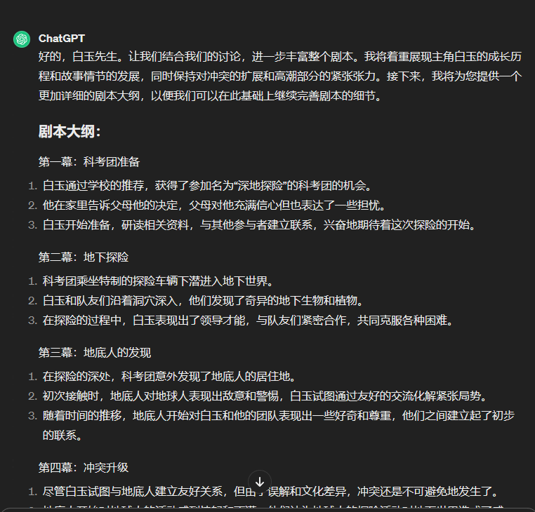
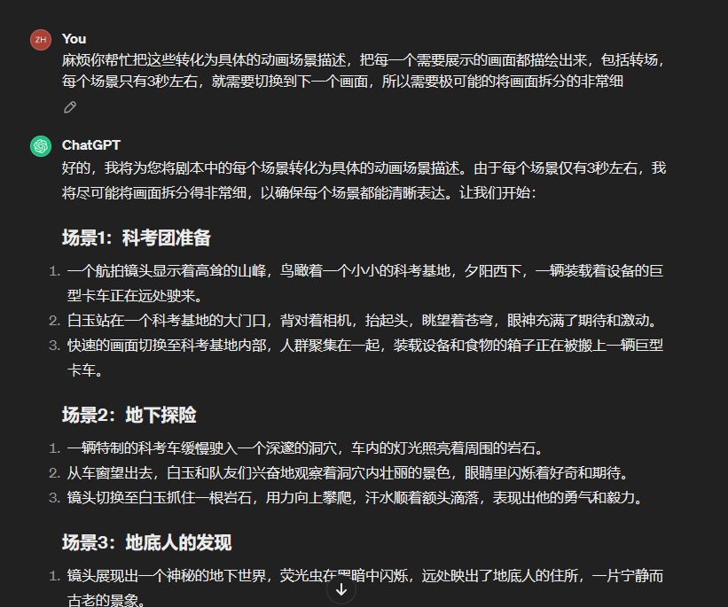
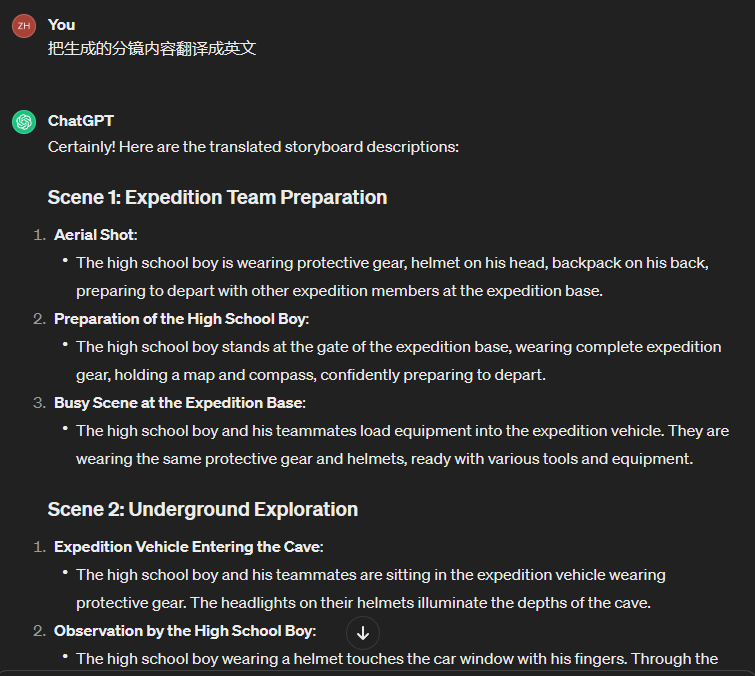
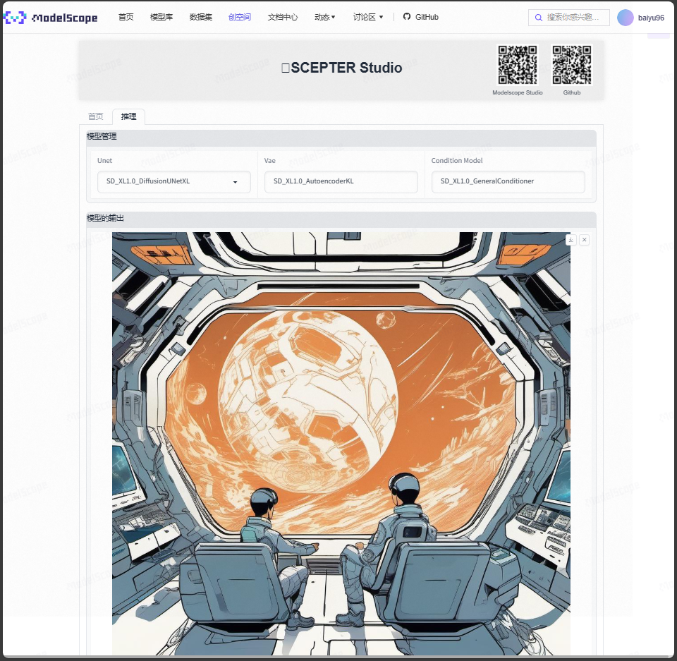
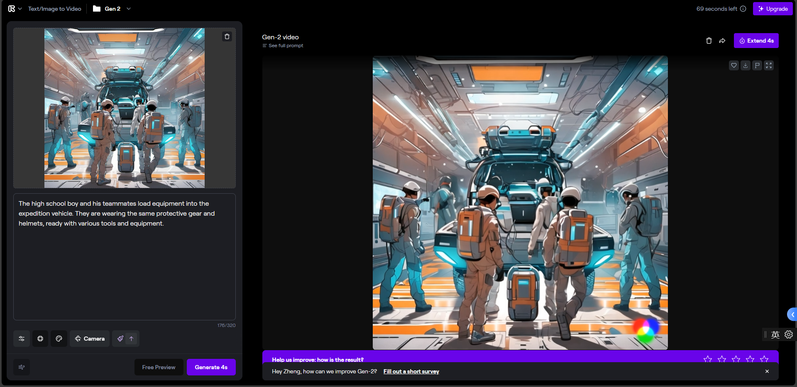

# Sora复现步骤+动手生成视频

Sora复现的简单架构如下

复现的步骤包含：数据集准备、数据预处理、视频时空压缩、训练模型、评估与微调

## 数据准备
### VideoInstruct-100k

VideoDirect100K 是一个使用人工辅助和半自动注释技术生成的高质量视频会话数据集。数据集中的问题答案与以下内容相关：

* 视频摘要
* 基于描述的问答(探索空间、时间、关系和推理概念)
* 创造性/生成性问题-答案

关于VideoInstruct-100k的内容，请戳链接：https://github.com/mbzuai-oryx/Video-ChatGPT/blob/main/data/README.md

模型下载地址：

* https://huggingface.co/datasets/MBZUAI/VideoInstruct-100K
* https://modelscope.cn/datasets/AI-ModelScope/VideoInstruct-100K/summary

### Panda-70M

Panda-70M 是一个拥有70M 高质量视频字幕对的大规模数据集。由以下三部分组成：

* 数据集数据加载包括列出 Panda-70M 数据的 csv 文件和下载数据集的代码。
* 分割包括将长视频分割成多个语义一致的短片的代码。
* 字幕包括在模型 Panda-70M 上训练的拟议的视频字幕。

相关链接：

* 论文：https://arxiv.org/pdf/2402.19479.pdf
* GitHub地址：https://github.com/snap-research/Panda-70M

### Youku-mPLUG

Youku-mPLUG是优酷联合达摩院一起开源的一个中文视频文本大规模数据集。包含1000万条数据的大规模中文视频语言预训练数据集及基准测试。

相关链接：

* 论文：https://arxiv.org/pdf/2306.04362.pdf
* Github地址：https://github.com/X-PLUG/Youku-mPLUG/
* 数据集地址：https://modelscope.cn/datasets/modelscope/Youku-AliceMind/summary

### MSR-VTT

MSR-VTT（Microsoft Research Video to Text）是一个开放域视频字幕的大规模数据集。

- 由  20  个类别的  10,000  个视频片段组成，每个视频片段由  Amazon Mechanical Turks  标注了  20  个英文句子。
- 所有标题中约有  29,000  个独特单词。
- 标准分割使用  6,513  个 split 用于训练，497  个 split 用于验证，2,990  个 split 用于测试。

### Shot2Story

视频文本基准和用于多镜头视频理解的可扩展代码。包含 20k  视频的详细长摘要和  80k  视频镜头的镜头字幕。

### InternVid

一个以视频为中心的大规模多模态数据集，可用于学习强大且可迁移的视频-文本表示，用于多模态理解和生成。

相关链接：

* 论文：https://arxiv.org/abs/2307.06942
* Github地址：https://github.com/OpenGVLab/InternVideo/tree/main/Data/InternVid

## 数据预处理

[Data-Juicer](https://github.com/alibaba/data-juicer/docs/DJ_SORA_ZH.md)  扩展了对多模态数据的支持，已实现上百个专用的视频、图像、音频、文本等多模态数据处理算子及工具，帮助用户分析、清洗及生成大规模高质量数据。

## Data-Juicer实践

* [动手实践DataJuicer](./DataJuicer.md)

## 动手生成视频

### 使用的工具

* 文生剧本/分镜：[ChatGPT](https://chat.openai.com/)
* 文生图：[scepter_studio](https://modelscope.cn/studios/iic/scepter_studio/summary)
* 图生视频：[runway](https://app.runwayml.com/)

### **《地底之谜：末日之殇》**

首先通过G老师生成大致剧本

然后生成对应的分镜头

再让G老师帮忙翻译一下

通过Scepter-Studio生成分镜头图片

最后通过runway来进一步生成动画

<video src="./assets/Scene-1-2.mp4"></video>
后面剪辑视频ing

敬请期待~